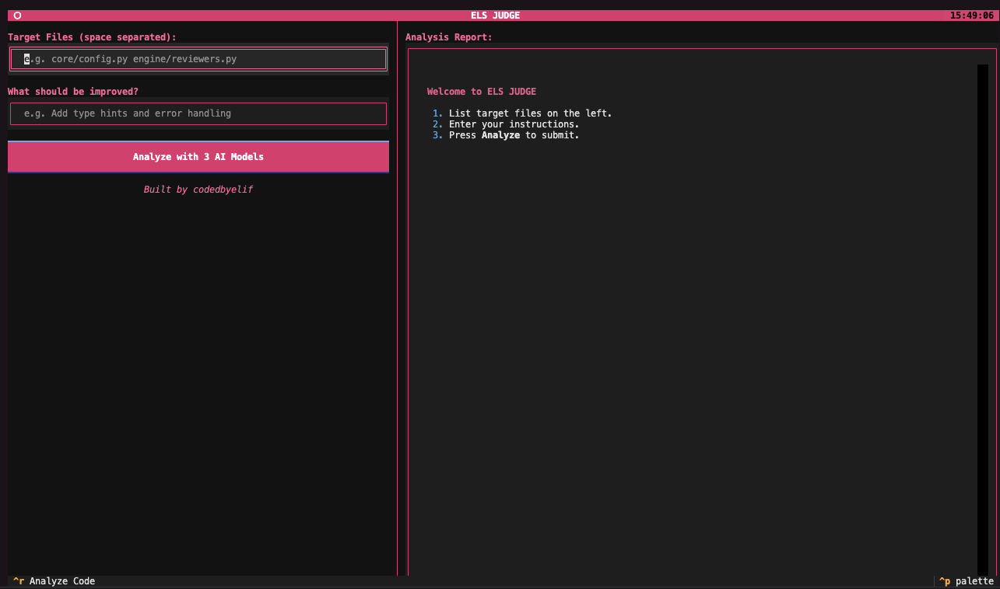

# ELS JUDGE

**Built by [codedbyelif](https://github.com/codedbyelif)**

A production-ready code evaluation application. It uses a Textual-based Terminal User Interface (TUI) to evaluate and improve code using multiple large language models. The engine sends your code and instructions simultaneously to three different models and displays a side-by-side comparison of the improvements directly in your terminal.



---

## Features

- **TUI-based Workflow:** Easy-to-use terminal interface via Textual.
- **Parallel Judge Execution:** AI models are executed in parallel via asyncio, speeding up evaluations without blocking.
- **Multi-Model Support:** Configured to use three state-of-the-art models for diverse opinions:
  - **Primary:** `gpt-4o` (OpenAI)
  - **Secondary:** `zai/glm-4.5-flash` (ZhipuAI/Zai)
  - **Tertiary:** `gemini/gemini-flash-latest` (Google Gemini)

---

## Quick Start

### 1. Clone the repository

```bash
git clone https://github.com/codedbyelif/els-judge.git
cd els-judge
```

### 2. Configure API keys

Create a `.env` file in the project root and add your API keys:

```env
OPENAI_API_KEY=sk-...
ZAI_API_KEY=your_key...
ZHIPUAI_API_KEY=your_key...
GEMINI_API_KEY=AIzaSy...
```

### 3. Run Locally

Create a virtual environment and run the application:

```bash
python3 -m venv venv
source venv/bin/activate
pip install -r requirements.txt
bash start.sh
```

### 4. Run with Docker (Optional)

You can also run the application using Docker. Note that if you are using Docker, you still have to pass the API keys appropriately.

```bash
docker build -t els-judge .
docker run -it --env-file .env els-judge
```

*(Note that the Docker image is configured to run `./start.sh` automatically in the container.)*

---

## How to Use the TUI

1. Run the app with `bash start.sh` or `python cli.py`.
2. Enter the **Target Files** you want to modify (e.g., `core/config.py engine/reviewers.py`).
3. Write what you want improved in the **"What should be improved?"** input box.
4. Click **"Analyze with 3 AI Models"** or press `CTRL+R`.
5. Check out the consolidated Markdown report comparing the generated diffs on the right side of the screen.

---

## Architecture Patterns

This project was inspired by Microsoft's open-source **LLM-as-Judge** framework.

### Key Patterns

| Pattern                  | Implementation                      | Explanation                                                                                  |
|--------------------------|-------------------------------------|----------------------------------------------------------------------------------------------|
| **Parallel Execution**   | `engine/dispatcher.py`              | `asyncio.gather` is used to invoke all 3 LLMs simultaneously, keeping latency to a minimum. |
| **Orchestrator Pattern** | `engine/dispatcher.py`              | A single entry point that manages submission, gathering, diff analyzing, and report generation.|
| **Unified Results**      | `engine/aggregator.py` & `reporter` | Consolidates individual model suggestions into one cohesive, viewable Markdown summary.      |

---

## Project Structure

```
ai-code-judge/
  cli.py               # Textual TUI entry point
  start.sh             # Branded launcher script
  Dockerfile           # Docker specification
  requirements.txt     # Python dependencies
  core/                # Settings, DB, git management
  engine/              # Litellm integration, diff analyzers, report generation
  models/              # Domain components (if any)
  schemas/             # Pydantic schemas for data validation
```

---

**Built by [codedbyelif](https://github.com/codedbyelif)** | ELS JUDGE v1.0
